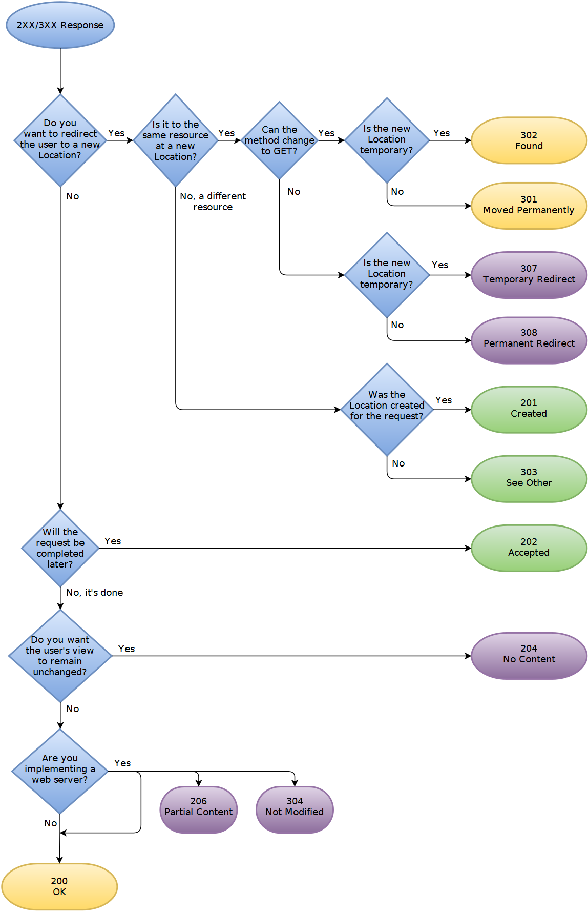

## [301, 302, 303, 307, 308](https://zhuanlan.zhihu.com/p/60669395)

在返回时都会带有 Location 头部，用于引导浏览器跳转。

303: 常用于POST请求成功后重定向到成功页面（强制使用 GET 请求）。

```text
                                                             +-----------+-----------+
                                                             | Permanent | Temporary |
+------------------------------------------------------------+-----------+-----------+
| Allows changing the request method from POST to GET        | 301       | 302       |
+------------------------------------------------------------+-----------+-----------+
| Doesn't allow changing the request method from POST to GET | 308       | 307       |
+------------------------------------------------------------+-----------+-----------+
```
