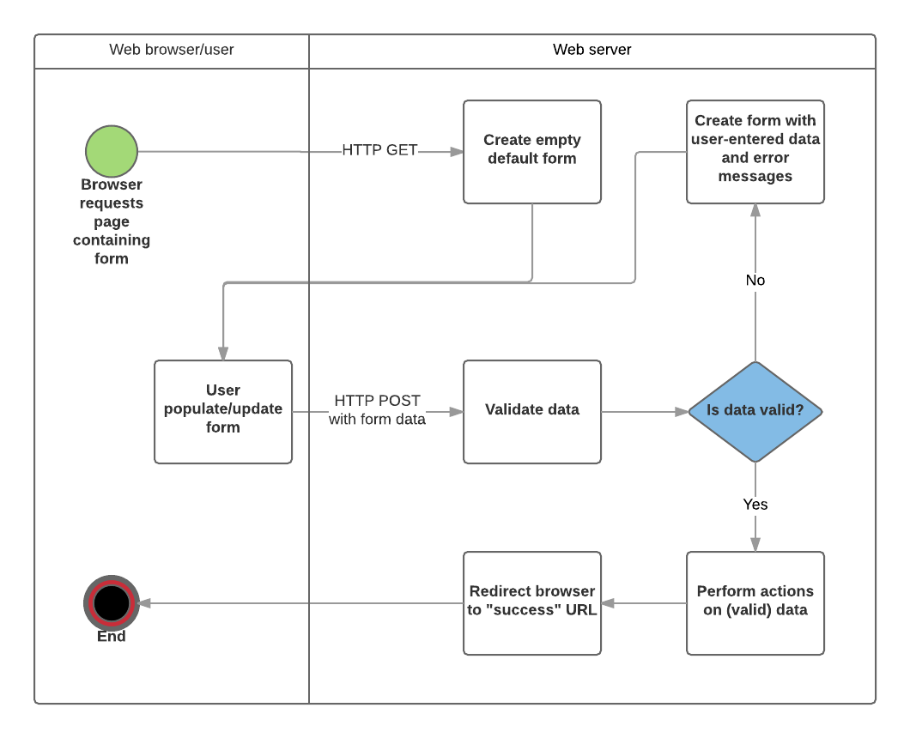

## Validation and sanitization

在将表单数据发送到服务器之前，需要考虑两个重要步骤：

- 验证（Validation）：确保用户输入符合指定的标准，例如必填字段、正确的格式等。
- 清理（Sanitization）：清理用户输入的数据，以防止处理恶意数据，例如移除或编码潜在的恶意字符。

并不总是需要在获取数据时立即进行清理——有时，在实际使用数据之前再进行清理会更合理。

