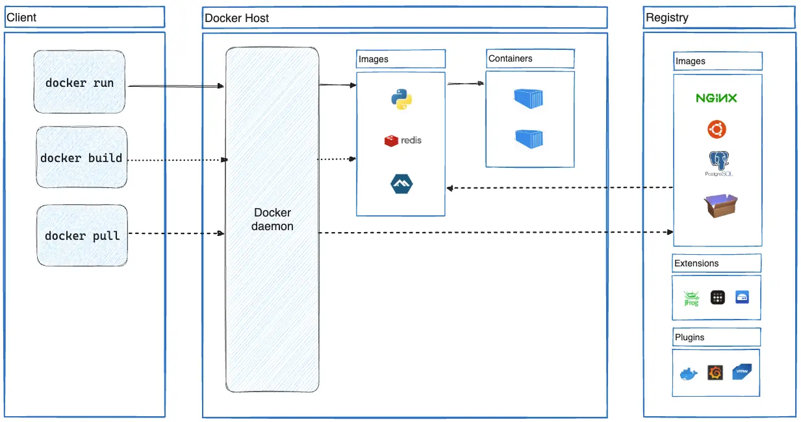

# Docker architecture


# The basics

## Container
Containers are **isolated processes** for each of your app's components. Each component - the frontend React app, the Python API engine, and the database - runs in its own isolated environment, completely isolated from everything else on your machine.

## Image
A container image is a standardized package that includes all of the files, binaries, libraries, and configurations to run a container.

- Images are immutable.
- Container images are composed of layers. Each layer represents a set of file system changes that add, remove, or modify files.

> Dockerfile versus Compose file
>
> Dockerfile 提供构建容器镜像的指令，而 Compose 文件 定义运行中的容器。通常，Compose 文件会引用 Dockerfile 来构建特定服务所需的镜像。

# Building images

## Dockerfile
```dockerfile
# 指定构建所基于的基础镜像。
FROM node:20-alpine
# 指定工作目录，即容器镜像中用于复制文件和执行命令的路径。
WORKDIR /app
# 告诉构建器复制文件，将主机上的文件放入容器镜像中。
COPY . .
# 告诉构建器运行指定命令。
RUN yarn install --production
# 设置容器的默认命令，即使用该镜像运行容器时执行的默认命令。
CMD ["node", "src/index.js"]
# 声明容器内的应用程序将要监听的端口
EXPOSE 3000
```

## Build cache
- RUN 指令的命令发生任何更改，都会使该层失效。
- 通过 COPY 或 ADD 指令复制到镜像中的文件发生任何更改，都会使该层失效。
- 一旦某一层失效，其后的所有层也都会失效，需要重新构建。

对于基于 Node 的应用，依赖项定义在 package.json 文件中。如果该文件发生更改，则需要重新安装依赖项；如果未更改，则应使用缓存的依赖项。因此，首先只复制 package.json 文件，然后安装依赖项，最后再复制项目的其他文件。这样，只有当 package.json 发生变化时，才需要重新安装 Yarn 依赖项。

```dockerfile
FROM node:lts-alpine
WORKDIR /app
COPY package.json yarn.lock ./
RUN yarn install --production
COPY . .
CMD ["node", "src/index.js"]
```

## Multi-stage builds
对于 JavaScript、Ruby 或 Python 这类解释型语言，可以在一个阶段中构建和压缩（minify）代码，然后将生产环境可用的文件复制到更小的运行时镜像中。这样可以优化镜像，使其更适合部署。
```shell
# Stage 1: Build Environment
FROM builder-image AS build-stage
# Install build tools (e.g., Maven, Gradle)
# Copy source code
# Build commands (e.g., compile, package)

# Stage 2: Runtime environment
FROM runtime-image AS final-stage
#  Copy application artifacts from the build stage (e.g., JAR file)
COPY --from=build-stage /path/in/build/stage /path/to/place/in/final/stage
# Define runtime configuration (e.g., CMD, ENTRYPOINT)

# --from 用于从另一个构建阶段或已有镜像复制文件到当前构建环境。
```

```dockerfile
# syntax=docker/dockerfile:1
FROM node:lts AS build
WORKDIR /app
COPY package* yarn.lock ./
RUN yarn install
COPY public ./public
COPY src ./src
RUN yarn run build

FROM nginx:alpine
COPY --from=build /app/build /usr/share/nginx/html
```

# Running containers
## Publishing and exposing ports
```shell
docker run -d -p HOST_PORT:CONTAINER_PORT IMAGE

# 将主机的 8080 端口绑定到容器的 80 端口。
docker run -d -p 8080:80 docker/welcome-to-docker
```

```yaml
services:
  app:
    image: docker/welcome-to-docker
    ports:
      - 8080:80
```

自动将所有暴露的端口映射到临时端口。这种方式在开发或测试环境中非常有用，可以避免端口冲突的问题。
```shell
docker run -P
```

`--env-file` 命令用于在运行 Docker 容器时从文件中读取环境变量。
```shell
docker run --env-file .env postgres env
docker run -e foo=bar postgres env
```

```shell
docker run -d -p 127.0.0.1:3000:3000 getting-started
# -d 后台运行容器，这意味着 Docker 会启动你的容器后立即返回终端提示符。
# 127.0.0.1:3000:3000 将主机的 3000 端口绑定到容器的 3000 端口。
```

## Persisting container data - Volumes

如果希望容器内生成或修改的数据在容器停止运行后仍然保持不丢失。

```shell
docker volume create log-data
docker run -d -p 80:80 -v log-data:/logs docker/welcome-to-docker
```

```shell
docker volume ls
docker volume rm <volume-name-or-id>
docker volume prune # 删除所有未使用的卷
```

```shell
docker volume create todo-db
docker run -dp 127.0.0.1:3000:3000 --mount type=volume,src=todo-db,target=/etc/todos getting-started

docker volume inspect todo-db
```


## Bind mount

如果希望主机系统和容器之间直接共享特定的文件或目录（比如配置文件或开发代码）。

```shell
docker run -d --name my_site -p 8080:80 --mount type=bind,source=./,target=/usr/local/apache2/htdocs/ httpd:2.4
```

```shell
docker run -dp 127.0.0.1:3000:3000 \
    -w /app --mount type=bind,src="$(pwd)",target=/app \
    node:18-alpine \
    sh -c "yarn install && yarn run dev"
```

## Custom network

```shell
docker network create mynetwork
docker network ls
docker network rm mynetwork
```

```shell
docker run -d -e POSTGRES_PASSWORD=secret -p 5434:5432 --network mynetwork postgres
```

`type=volume,src=my-volume,target=/usr/local/data`

`type=bind,src=/path/to/data,target=/usr/local/data`

## Multi-container applications
```shell
docker build -t nginx .
docker build -t web .

docker network create sample-app
docker run -d  --name redis --network sample-app --network-alias redis redis
docker run -d --name web1 -h web1 --network sample-app --network-alias web1 web
docker run -d --name web2 -h web2 --network sample-app --network-alias web2 web
docker run -d --name nginx --network sample-app  -p 80:80 nginx
docker ps

```

Simplify the deployment using Docker Compose


```shell
docker compose up -d --build
```

# Command
```shell
docker init
```

```shell
docker build -t TARGET_IMAGE .
# . 表示 Docker 应该在当前目录中查找 Dockerfile。
```

```shell
docker image ls # 列出本地 Docker 镜像
```

```shell
docker image history IMAGE # Show the history of an image
```

```shell
docker ps # 列出正在运行的容器
docker stop <container-id> # 停止正在运行的容器
docker rm <container-id> # 删除容器
docker rm -f <the-container-id> # 停止并删除容器
```

```shell
docker logs <container-id> # 查看容器日志
```

```shell
docker compose up
# 读取 docker-compose.yml 文件
# 拉取（如果本地没有）并构建镜像
# 创建并启动容器
# 显示日志，并在终端保持运行状态

# -d Detached mode: Run containers in the background
# --build Build images before starting containers
```

```shell
docker compose down # 停止并删除所有容器
```
## Postgres with volume

```shell
docker run --name=db -e POSTGRES_PASSWORD=secret -d -v postgres_data:/var/lib/postgresql/data postgres

```

```shell
docker exec -ti db psql -U postgres
```
1. docker exec 在正在运行的容器中执行命令
2. -ti 表示分配一个伪终端
3. psql -U postgres 连接到 PostgreSQL 数据库，使用 postgres 用户
4. \q 退出 psql


```shell
docker stop db
docker rm db
```

```shell
docker run --name=new-db -d -v postgres_data:/var/lib/postgresql/data postgres
```

```shell
docker exec -ti new-db psql -U postgres -c "SELECT * FROM tasks"
```
## Compose file

`command`: 覆盖容器镜像中声明的默认命令，例如 Dockerfile 中的 `CMD` 指令。

## [Compose watch](https://docs.docker.com/compose/how-tos/file-watch/)
