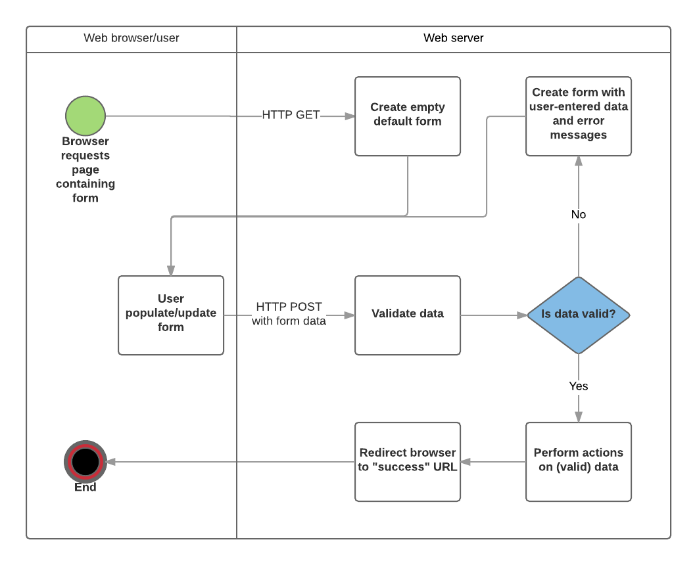

# `@repo/express`

> 控制器（Controller）的职责实际上就是充当最终的中间人（middleman）。它知道需要向模型（Model）提出哪些问题，但将解决这些问题的繁重工作交给模型来完成。它知道需要渲染哪个视图（View）并将其发送回浏览器，但会让视图负责将所有 HTML 组装起来。这就是为什么称它为“控制器”的原因——它足够智能，知道应该做什么，然后将所有的繁重工作委派出去。

> 中间件（Middleware）是 Express 的核心功能之一，它允许你在请求-响应周期的特定阶段运行代码、修改请求，或结束该周期。因此，在 Express 中，我们使用中间件来实现 MVC 模式中的“控制器”（Controller）部分。

## Validation and sanitization

在将表单数据发送到服务器之前，需要考虑两个重要步骤：

- 验证（Validation）：确保用户输入符合指定的标准，例如必填字段、正确的格式等。
- 清理（Sanitization）：清理用户输入的数据，以防止处理恶意数据，例如移除或编码潜在的恶意字符。

并不总是需要在获取数据时立即进行清理——有时，在实际使用数据之前再进行清理会更合理。

